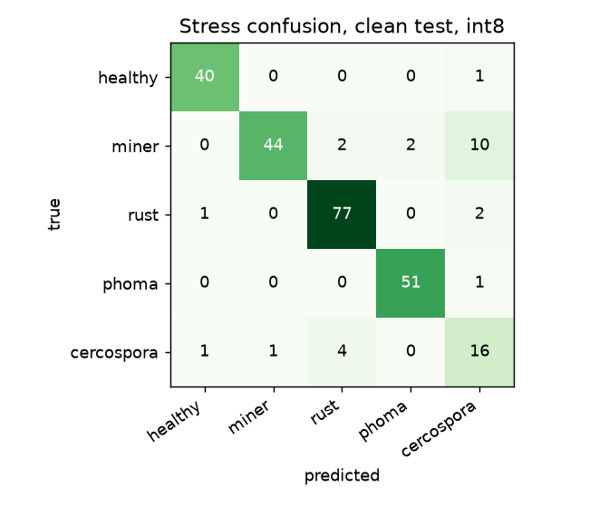
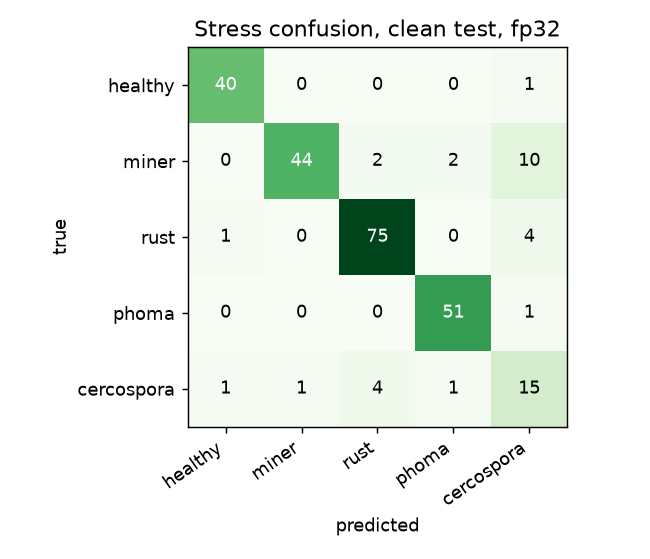
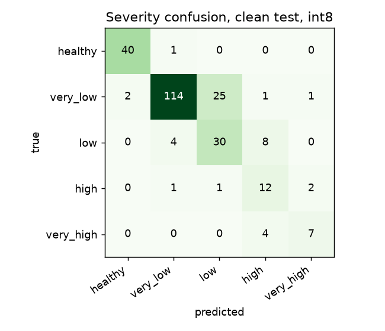
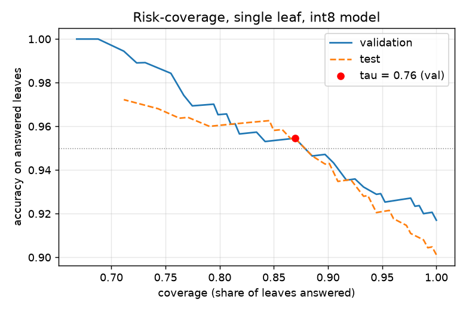
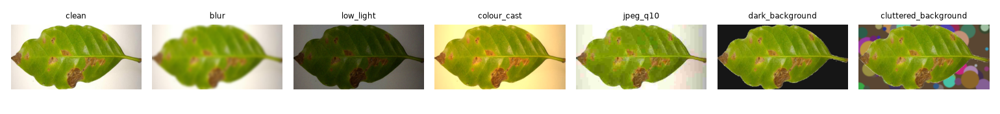

# Jirani model evaluation report

_Generated by `ml/evaluate.py`. Every number below is measured by running the exported ONNX models with onnxruntime (the same graphs the app runs), with temperature scaling applied._

## 1. Dataset

BRACOL leaf dataset: label file from Mendeley (CC BY 4.0), leaf crops from the authors' repo (github.com/esgario/lara2018). Stress code 5 is excluded (undocumented). Split: stratified by stress class, 70/15/15, seed 150. See `DATA.md`.

| Split | n | healthy | miner | rust | phoma | cercospora |
|---|---|---|---|---|---|---|
| train | 1179 | 190 | 271 | 372 | 243 | 103 |
| val | 253 | 41 | 58 | 79 | 53 | 22 |
| test | 253 | 41 | 58 | 80 | 52 | 22 |

| Split | healthy | very_low | low | high | very_high |
|---|---|---|---|---|---|
| train | 190 | 640 | 238 | 73 | 38 |
| val | 41 | 141 | 52 | 12 | 7 |
| test | 41 | 143 | 42 | 16 | 11 |

Training: 5.8 min on NVIDIA GeForce RTX 5060 Laptop GPU; best checkpoint at finetune:21.

## 2. Stress classification, clean test set (n = 253)

| Model | Accuracy | Macro-F1 | recall healthy | recall miner | recall rust | recall phoma | recall cercospora |
|---|---|---|---|---|---|---|---|
| fp32 | 88.9% | 0.856 | 97.6% | 75.9% | 93.8% | 98.1% | 68.2% |
| int8 (shipped) | 90.1% | 0.870 | 97.6% | 75.9% | 96.2% | 98.1% | 72.7% |

 

## 3. Severity

| Model | Exact accuracy | Within one level |
|---|---|---|
| fp32 | 84.2% | 99.2% |
| int8 (shipped) | 80.2% | 98.8% |

Severity levels are % of leaf area with symptoms (very low 0.1–5%, low 5–10%, high 10–15%, very high >15%). 'High' and 'very high' have few training examples (73 and 38), so treat severity as a rough guide.

## 4. Model size

| Variant | Size | Test stress accuracy |
|---|---|---|
| fp32 ONNX | 3.74 MB | 88.9% |
| int8 per-tensor | 1.13 MB | 9.1% |
| int8 per-channel | 1.24 MB | 28.5% |
| int8 per-channel, heads fp32 | 1.26 MB | 27.7% |
| int8 weight-only per-channel, fp32 activations | 1.04 MB | 90.1% |

**Shipped: `model.int8.onnx`, 1.04 MB (int8 weight-only per-channel, fp32 activations).** Full static int8 quantization (weights and activations) collapsed accuracy on this MobileNetV3: the hard-swish / squeeze-excite activations do not survive 8-bit activation quantization. Weights alone quantize to int8 with no loss, so the shipped file stores int8 weights and computes in fp32. This shrinks the download but does not speed up inference.

## 5. Calibration and the refusal threshold

Temperature T = 1.056 (val NLL 0.234 → 0.234, ECE 0.030 → 0.025). tau = **0.76**: the lowest threshold where answered accuracy on validation is ≥ 95% (floor 0.65).

| At tau | Coverage | Accuracy on answered |
|---|---|---|
| validation, single leaf | 87.0% | 95.5% |
| test, single leaf, int8 | 89.7% | 94.3% |
| test, three-leaf rule (simulated, 82 triples) | 75.6% | 100.0% |

The three-leaf row groups different test leaves of the same class into triples and applies the app's rule (mean probability ≥ tau and at least two leaves agree). It is a simulation, not three leaves from one tree.

### App preprocessing path

The app crops each photo to the leaf's bounding box itself. We ran that crop (Python mirror of the app code) on the uncropped Mendeley originals of 193 test leaves:

| Input | Accuracy | Coverage at tau | Accuracy on answered |
|---|---|---|---|
| authors' crops (same leaves) | 91.2% | 90.2% | 94.8% |
| originals + app crop | 90.2% | 88.6% | 96.5% |

## 6. Perturbed test set (SYNTHETIC perturbations)

Generated from the clean test crops to stand in for messy field photos. These are synthetic, not real field images.

| Condition | Accuracy | Coverage at tau | Accuracy on answered | Severity acc |
|---|---|---|---|---|
| clean | 90.1% | 89.7% | 94.3% | 80.2% |
| blur | 90.1% | 81.8% | 96.6% | 81.4% |
| low_light | 70.8% | 62.8% | 85.5% | 53.8% |
| colour_cast | 83.8% | 81.0% | 92.7% | 64.4% |
| jpeg_q10 | 73.1% | 69.2% | 83.4% | 58.9% |
| dark_background | 80.6% | 74.3% | 91.5% | 75.9% |
| cluttered_background | 54.9% | 50.2% | 70.9% | 12.6% |
| **all perturbed** | 77.2% | 71.7% | 88.5% | |

Drop in accuracy, clean → all perturbed: **12.9 points**. In the app, the quality gate rejects blurry, dark and leafless photos before the model sees them; the numbers above are the model alone, without the gate.

## 7. Out-of-distribution refusal (higher is better)

| Set | n | Refused |
|---|---|---|
| PlantDoc non-coffee leaves, single image | 81 | 48.1% |
| PlantDoc, three images of one class, app rule | 27 | 77.8% |
| SYNTHETIC non-leaf images, single image | 7 | 100.0% |

PlantDoc images the model still answered confidently were labelled: {'rust': 29, 'phoma': 12, 'healthy': 1}. Synthetic images answered confidently: none. These are model-only numbers. In the app, the quality gate (leaf-colour fraction, blur, exposure) is an extra layer in front of the model.

## 8. Known limits

- BRACOL is Brazilian (Espirito Santo). No Kenyan or East African varieties (SL28, SL34, Ruiru 11) and no highland Kenyan field conditions.
- No nutrient-deficiency class. Yellowing from nitrogen deficiency is not a trained label; it should fall through to 'not sure', but this is not guaranteed.
- Single detached leaves, lower side, on a white background. Not leaves on the tree, not cluttered backgrounds.
- No abiotic stress labels (drought, frost, sunscald).
- Only the predominant stress per leaf is labelled, though several can co-occur.
- Severity classes are imbalanced; 'high' and 'very high' are rare, and almost absent for cercospora.
- The perturbed set is synthetic and the OOD set is small (PlantDoc sample + synthetic images). Neither replaces a field test.
- Rainfall and soil context (used by the cause ranking, not by this model) come from coarse global grids.
- The cooperative registry and outbreak reports in the demo are synthetic.
